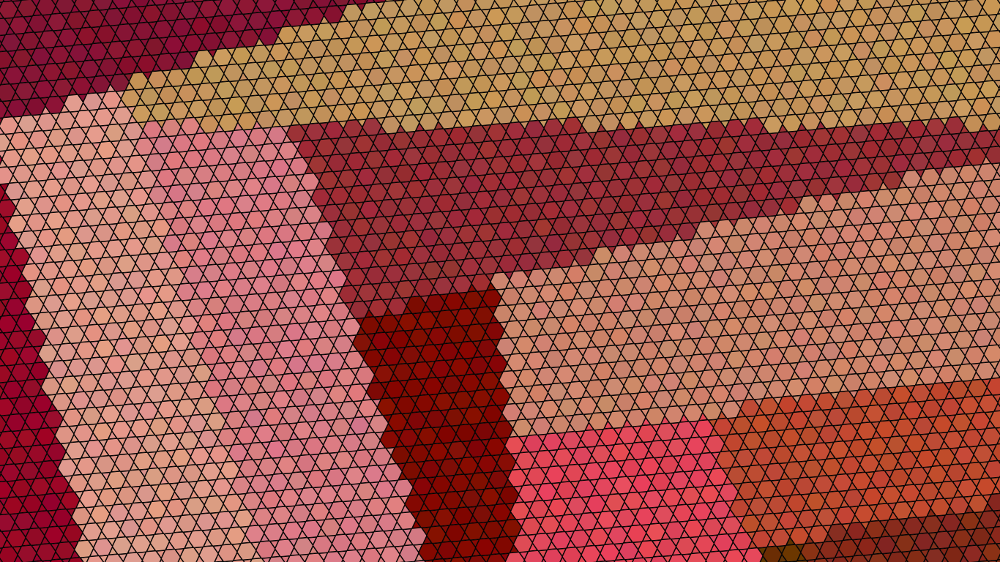

# wallrnd
### A configurable generator of random abstract time-aware wallpapers

[](https://github.com/Vanille-N/wallrnd)
[](https://opensource.org/licenses/MIT)

---
Direct dependencies

`serde` [](https://crates.io/crates/serde)
[](https://docs.rs/serde)

`serde_derive` [](https://crates.io/crates/serde_derive)
[](https://docs.rs/serde_derive)

`rand` [](https://crates.io/crates/rand)
[](https://docs.rs/rand)

`toml` [](https://crates.io/crates/toml)
[](https://docs.rs/toml)

`chrono` [](https://crates.io/crates/chrono)
[](https://docs.rs/chrono)

`delaunator` [](https://crates.io/crates/delaunator)
[](https://docs.rs/delaunator)

---

This project aims to provide a utility for generating random abstract wallpapers.

It is only intended for **generating** the images (SVG), not actually setting them as a wallpaper.

A bash script to automatically change wallpaper is provided, and has been tested on Ubuntu 20.04 (Focal Fossa).
Portability of this script is outside of the scope of this project (the image generator however should be portable to any OS), but scripts that work for other shells/distros are welcome.


---

```diff
~ Warning: Breaking change
~ Since the addition of command line options, your launch script may be broken for the latest version
~ You can either download a version of wallrnd earlier than Jul 15, 2020, or see the new format
~ in setup/set-wallpaper (previous script moved to setup/set-wallpaper-obsolete)
~ To update your script, all you need is to replace
- wallrnd /path/to/image.svg /path/to/config.toml
~ with
+ wallrnd --image /path/to/image --config /path/to/config.toml
```

### Recommended setup (executable `wallrnd`)

* `cargo build --release` (1.44 stable) to create the `wallrnd` executable

* Put `wallrnd` and `setup/wallrnd.toml` in a directory `$DIR`

* Edit accordingly the `set-wallpaper` script, make it executable, and add it to a folder in your `$PATH`

* Adjust the colors, themes, shapes in `wallrnd.toml` to your liking

* Make a new Crontab entry: `* * * * * set-wallpaper`

Performance is good enough that running it every 60 seconds is not even noticeable (4-core Intel i5).

Thanks to [`nice`](https://en.wikipedia.org/wiki/Nice_(Unix)) giving the program a very low priority, it can run in the background without issue. The script also exits early when running on battery.

### Recommended setup (executable `prototype.py`)

`wallrnd` is a more developed product than this, but if you still want to use the prototype it is possible.

Be warned that performance is a lot worse and that this version is far less configurable.

* Edit `set-wallpaper` to your liking, make it executable, and add it to your `$PATH`.

* Make a new Crontab entry: `* * * * * set-wallpaper`

[`psutil`](https://pypi.org/project/psutil/) is used to abort the process if CPU usage is already high.

---

### Alternative tools

#### Online

* [Random Wallpaper Generator!](http://bjmiller.net/canvas/wallpaper/)

* [Background Generator](https://bggenerator.com/)

#### Scripts

* [flopp/RandomWallpapers](https://github.com/flopp/RandomWallpapers)

#### Apps
* [Tapet](https://play.google.com/store/apps/details?id=com.sharpregion.tapet&hl=en_US)

### Examples

As a random generator of wallpaper ought to provide images of consistent quality, the following sample of images is **unfiltered**<a name="return-methodology">[\*](#methodology)</a>. All were created with a configuration file similar to the one provided under `setup/wallrnd.toml`.





<a name="methodology">[\*](#return-methodology)</a> To provide a variety of patterns, tilings, and themes, the six were created in succession by altering the configuration file slightly so that only one pattern, tiling, and theme was available. This method guarantees variability without biasing quality. Hence the above sample can be considered representative of the general quality of generated wallpapers.
